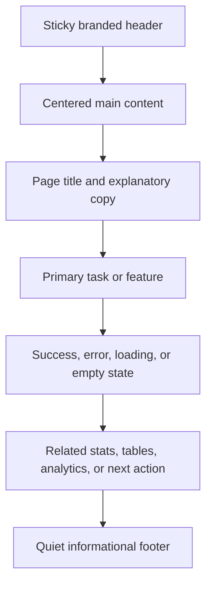

# Intranet from the Trenches — Application Style & Design Rules

**Status:** Active design standard  
**Audience:** Product owners, designers, developers, and future feature contributors  
**Applies to:** Public pages, authenticated management pages, analytics, forms, tables, link results, and future application features  
**Visual reference:** [Intranet from the Trenches](https://intranetfromthetrenches.substack.com/)

---

## 1. Purpose and Design Direction

This document is the implementation guide for the URL Shortener application. Every new feature should use these rules unless an explicit design decision records an intentional exception.

The application combines an editorial publishing feel with a practical internal-tool interface:

- **Editorial first:** Content hierarchy, readable prose, and clear section titles take priority over decorative UI.
- **Quiet utility:** Controls should be obvious, compact, flat, and easy to scan.
- **High contrast:** Text and controls must remain readable on white and soft-grey surfaces.
- **Structured simplicity:** Use borders, dividers, spacing, and typography to create hierarchy instead of gradients, heavy shadows, or ornamental effects.
- **Purposeful emphasis:** Green is the primary action/accent; warm amber and red are reserved for warnings, privacy, destructive, or Decay Link states.
- **Responsive by default:** Desktop layouts may use columns, but every feature must remain usable on tablet and mobile widths.
- **Consistent semantics:** Visual hierarchy must follow semantic HTML. Do not use a styled paragraph where a heading, label, button, or link is required.

### Design decision priority

When rules appear to conflict, apply this order:

1. Accessibility and semantic correctness.
2. Existing application behavior and security boundaries.
3. Readability and responsive usability.
4. Shared tokens and component patterns in `app/globals.css`.
5. Page-specific visual treatment.

---

## 2. Visual Foundations

### 2.1 Color tokens

Use CSS variables or existing shared values rather than introducing one-off colors. The current application implementation is authoritative; the older `ui-rules.md` describes the broader editorial direction but uses a teal reference accent. The live application uses the green accent below.

| Role | Current value | Usage |
| --- | --- | --- |
| Primary background | `#FFFFFF` / `--color-bg-primary` | Page background, cards, input surfaces |
| Secondary background | `#F9F9F9` / `--color-bg-secondary` | Toolbars, metadata blocks, secondary cards, table striping |
| Primary text | `#151515` / `--color-text-primary` | Headings, body text, important values |
| Secondary text | `#666666` / `--color-text-secondary` | Metadata, hints, timestamps, supporting copy |
| Brand accent | `#66CD7A` / `--color-brand-accent` | Primary buttons, active links, focus indicators, positive emphasis |
| Subtle border | `#E5E5E5` / `--color-border-subtle` | Input borders, cards, dividers, tables |
| Header border | `#E5E5E5` | Bottom rule beneath the sticky header |
| Error text/background | `#B91C1C` / `#FEF2F2` | Validation and request errors |
| Error border | `#FECACA` | Error containers and private-state warning edges |
| Decay amber | `#B45309` / `#FFFBEB` | Decay module border and warm security context |
| Decay danger | `#DC2626` / `#B91C1C` | Self-destructing-link CTA and destructive emphasis |
| Bot badge | `#92400E` / `#FEF3C7` | Bot classification |
| Human badge | `#166534` / `#DCFCE7` | Human classification |

**Do:** use dark text on light surfaces and preserve visible borders.  
**Do not:** use green for errors, red for ordinary actions, or warm warning colors as general decoration.

### 2.2 Typography

The application uses two complementary families:

| Content | Font family | Guidance |
| --- | --- | --- |
| H1, H2, H3, editorial titles, feature titles | `Georgia, "Times New Roman", Times, serif` | Warm editorial voice; use for hierarchy and narrative |
| Body copy, labels, buttons, inputs, navigation, metadata | `system-ui, -apple-system, BlinkMacSystemFont, "Segoe UI", Roboto, Helvetica, Arial, sans-serif` | Clean utility reading and controls |
| Short URLs, codes, technical values | `ui-monospace, SFMono-Regular, Menlo, Monaco, Consolas, "Liberation Mono", "Courier New", monospace` | Distinguish generated identifiers and URLs |

Recommended scale:

| Element | Desktop | Mobile | Weight / line height |
| --- | ---: | ---: | --- |
| H1 / page title | 32–42 px | 26–32 px | 700 / about 1.15 |
| H2 / major section | 24–28 px | 22–23 px | 600 / 1.25 |
| H3 / subsection | 18–20 px | 17–19 px | 600 / 1.3 |
| Body paragraph | 15–17 px | 14–17 px | 400 / 1.5–1.6 |
| Label / button | 13–15 px | 13–15 px | 500–700 / 1.2 |
| Metadata | 12–13 px | 12–13 px | 400–500 / 1.4 |

---

## 3. Layout and Spacing

### 3.1 Containers

- Center application content with `margin: 0 auto`.
- Use a maximum page width of approximately `1140px` for shared content and up to `1280px` where the homepage split layout needs additional room.
- Use horizontal gutters of `16px` on mobile, `24px` on tablet, and `32px` on desktop.
- Keep long-form reading content near `720px` where possible.
- Use the existing `main-content`, `container`, `home-centered`, `stats-detail-row`, and grid patterns before creating new layout primitives.

### 3.2 Spacing rhythm

Use multiples of 8px wherever practical:

- `8px`: icon-to-label or compact internal spacing.
- `12px`: metadata, small cards, control gaps.
- `16px`: normal component padding and paragraph separation.
- `24px`: form separation, card padding, subsection spacing.
- `32px`: major module separation.
- `48px–64px`: page-level breathing room and section separation.

Whitespace is part of the hierarchy. Do not compensate for unclear structure by adding more colors or borders.

### 3.3 Responsive behavior

| Viewport | Required behavior |
| --- | --- |
| Desktop | Use two-column layouts where they improve task flow; keep actions aligned and content readable. |
| Tablet | Reduce gaps and padding; allow controls to wrap without clipping. |
| Mobile (`<=768px`) | Stack columns, make primary controls full width where appropriate, preserve readable table access through responsive treatment. |
| Narrow mobile (`<=560px`) | Stack QR/details content and action groups; prevent horizontal overflow. |

Every new layout must be tested with long URLs, long titles, empty states, error states, and narrow widths.

### Application layout flow



---

## 4. Headings and Titles

### Rules

1. Use one clear H1-equivalent page title or primary title per page.
2. Use H2 for major page sections such as `Link Details`, `Analytics`, `Access Log`, and `Community Stats`.
3. Use H3 for cards, chart titles, and subsections beneath an H2.
4. Heading text must describe the content or action, not the implementation.
5. Keep titles concise. Put explanation in the paragraph below, not inside the heading.
6. Preserve the editorial serif treatment for headings and the utility sans-serif treatment for controls.
7. Do not skip heading levels merely to obtain a desired font size.

### Recommended pattern

```html
<section aria-labelledby="analytics-title">
  <h2 id="analytics-title">Analytics</h2>
  <p>Review link activity for the selected time range.</p>
  <h3>Clicks by Browser</h3>
</section>
```

### Page title examples

- `All Shortened URLs`
- `{title || original} data content`
- `Link Details`
- `Access Log`
- `Community Stats (Public URLs only)`

Avoid vague titles such as `Information`, `Data`, or `Details` without context.

---

## 5. Paragraphs, Copy, and Microcopy

- Start with the user benefit or task outcome.
- Keep paragraphs short: generally one idea per paragraph and no more than 2–4 sentences.
- Use plain, direct English and active voice.
- Explain security-sensitive behavior before the user commits an action.
- Use sentence case for normal UI copy. Use title case only for established page or section titles.
- Keep helper text visually secondary but readable; never rely on color alone.
- Use `(none)`, `Never`, or an explicit empty-state sentence consistently rather than leaving blank cells.
- Preserve the application's friendly internal-tool tone without adding marketing language to operational screens.

**Good:** “The link will not appear in public stats or recent lists.”  
**Avoid:** “This option changes visibility semantics.”

---

## 6. Links

### Link hierarchy

| Link type | Treatment | Use |
| --- | --- | --- |
| Standard content link | Brand green text, underline on hover | Original URLs, documentation, contextual navigation |
| Short URL | Green, bold, monospace or `.short-url` treatment | Generated links that users need to recognize and copy |
| Header/navigation link | Utility sans-serif, restrained, subtle hover surface | Login, Shorten, List, Settings, Logout |
| Back/secondary link | Normal link treatment with descriptive text | Return to a parent page or list |

### Link rules

- Link text must identify the destination or action; avoid “click here.”
- External links that open a new tab must use `target="_blank"` and `rel="noopener noreferrer"`.
- Do not make an entire card an invisible link when it contains independent actions.
- Preserve visible keyboard focus and a clear hover state.
- Long URLs must wrap with `word-break: break-all` or an equivalent safe strategy.
- Use buttons for state changes and commands; use links for navigation.

---

## 7. Buttons and Actions

### Button hierarchy

| Variant | Appearance | Appropriate use |
| --- | --- | --- |
| Primary | Green background, white text, bold utility font | Main task: `Shorten URL` |
| Secondary | White/soft-grey background, dark text, thin border | Refresh, copy, regenerate, filters, navigation controls |
| Warning/danger | Red background, white text | `Create Self-Destructing Link` or irreversible/destructive actions |
| Icon action | Compact bordered square with accessible label/title | Stats, privacy toggle, compact row actions |
| Text/tertiary | Minimal background and restrained padding | Header navigation and low-emphasis actions |

### Interaction rules

- Use action labels that describe the result: `Copy`, `Refresh List`, `Regenerate QR Code`.
- Keep primary actions visually dominant but not oversized.
- Use approximately `10–14px` vertical and `20–36px` horizontal padding for prominent actions.
- Use a modest `4px` border radius. Avoid pill-shaped controls.
- Hover should change opacity, background, or border; avoid large movement and elevation effects.
- Disabled controls must reduce contrast and use `cursor: not-allowed`; never communicate disabled state by opacity alone if the label becomes unreadable.
- Loading text should state the current action (`Shortening...`) and the control must be disabled.
- Icon-only buttons require an accessible name through visible text, `aria-label`, or an equivalent tooltip/title.
- When two mutually exclusive forms are active, grey out the inactive form without changing its action label.

```jsx
<button type="submit" className="prominent-button" disabled={loading}>
  {loading ? 'Shortening...' : 'Shorten URL'}
</button>
```

---

## 8. Forms, Inputs, and Validation

### Form structure

1. Section or form title.
2. Short explanatory copy when the action needs context.
3. A visible label for every input.
4. Input and helpful placeholder/example.
5. Optional helper text.
6. Primary action.
7. Inline error or success feedback immediately associated with the form.

### Input rules

- Use a solid white input surface with a `1px` border; use `2px` for the prominent Original URL field.
- Keep labels above fields and use `htmlFor`/`id` associations.
- Use `font-size: 15px–17px` for important URL input to support readability.
- Preserve entered values after validation errors.
- Use placeholders as examples, never as the only label.
- Give focus a visible green border and focus ring.
- Do not disable fields without explaining why; for login-gated options, show `(login required)` and retain readable greyed styling.
- Validate on the server even when client validation exists.
- Show errors in a dedicated `.error` block with clear corrective language.

### Advanced options

Advanced options should remain grouped and collapsible when they are not needed for the primary task. The current pattern is an accessible `Advanced Options` header with keyboard support, `aria-expanded`, and consistent `.option` cards.

### Privacy and Decay

- Private intent uses the existing soft red state (`.private-active`) and must not be confused with an error.
- Decay Link is a distinct full-width module below the primary Standard Link form.
- Decay uses amber context and a red CTA because it is single-use and security-sensitive.
- Explain permanence and one-time behavior before submission.

---

## 9. Results, Alerts, and Empty States

### Success/result blocks

Use the existing `.result` pattern for returned shortened links. Show information in this order:

1. Shortened URL, emphasized and actionable.
2. Original URL.
3. Optional title.
4. Short code, visibility, and type.
5. Creation metadata.
6. QR code and its actions, when available.

Results must appear directly beneath the form that created them. Standard and Decay results use separate state and error regions.

### Alerts

- **Error:** red text, pale red background, visible border; state what happened and how to recover.
- **Warning:** amber or warm red only when there is a meaningful risk or irreversible behavior.
- **Informational:** neutral secondary surface with normal text contrast.
- **Success:** do not rely only on green; include explicit text such as `Copied!` or `Title updated successfully.`

### Empty/loading states

Every data-driven section must define:

- Loading text that names the content being loaded.
- Empty text that explains what the user can do next.
- Error text that identifies the failed operation.
- A retry or refresh action when recovery is possible.

---

## 10. Tables and Data-Dense Views

Tables are for comparable records, not long prose.

### Required conventions

- Use a visible section heading and brief explanatory paragraph above the table.
- Use semantic `<table>`, `<thead>`, `<tbody>`, `<th>`, and `<td>` elements.
- Use `scope="col"` for column headers and `scope="row"` for row labels where appropriate.
- Keep header labels short and consistent.
- Use uppercase, tracked utility text for dense table headers only.
- Use `1px` borders, soft-grey header backgrounds, and light alternating rows.
- Align text left; align numeric values consistently when the table benefits from it.
- Wrap long original URLs and User-Agent strings safely.
- Provide sort indicators and make sortable headers keyboard accessible when possible.
- Keep actions in a final `Actions` column and use compact labeled/icon controls.
- Include a useful empty state instead of an empty table shell.
- Paginate long lists and show range metadata such as `Showing 1–10 of 42`.
- On mobile, prevent the whole page from overflowing; use responsive stacking or a deliberate horizontal scroll region.

### Current application examples

- URL list: searchable, sortable, column-selectable, paginated.
- Access log: timestamp-descending by default, sortable, paginated in groups of ten.
- Recent visits: server-limited to the latest 50 and rendered through a pager.
- Access counts: display as `human (bot)`; logs retain explicit `Human` or `Bot` labels.

---

## 11. Figures, QR Codes, Charts, and Visuals

### Figures and images

- Every meaningful image requires descriptive `alt` text.
- Decorative images use empty alt text (`alt=""`) rather than redundant descriptions.
- Keep images inside their content context; do not use decoration that competes with the main task.
- Add a short caption when the image needs interpretation.
- Preserve aspect ratio and provide a bordered white surface for QR images.

### QR code standard

- QR codes must encode the shortened URL, not the original URL.
- Show a clear heading such as `QR Code` and supporting text explaining what is encoded.
- Provide actions such as download, copy, or regenerate when available.
- Preserve adequate contrast and a quiet margin around the code.
- Provide a textual short URL so QR is never the only way to access the link.

### Charts and analytics

- Use an H2 for the dashboard and H3 for each chart.
- Display the selected time range clearly.
- Pair visual values with text labels or numeric values; never communicate a metric by color alone.
- Keep human and bot colors stable across charts: green for human, amber for bot.
- Preserve responsive overflow behavior for wide SVG/heatmap visuals.
- Provide empty states for ranges with no data.
- Keep charts dependency-free and consistent with the existing custom SVG/CSS approach unless a new decision is recorded.

---

## 12. Header, Navigation, and Footer

- The header is sticky, white, bordered, and centered within the shared max-width.
- The brand banner remains the visual anchor in the center.
- Header actions use restrained tertiary controls and wrap on small screens.
- Keep navigation labels task-oriented: `Shorten`, `List URLs`/`Settings`, `Login`, and `Logout`.
- Do not add competing large controls to the header without a clear product need.
- The footer is quiet, centered, small, and separated by a subtle top rule.

---

## 13. Accessibility and Quality Checklist

Before merging a new feature, verify:

- [ ] Semantic heading levels are correct and headings describe their sections.
- [ ] Every form field has a visible, associated label.
- [ ] Keyboard users can reach and operate every action.
- [ ] Focus states are visible against white and grey surfaces.
- [ ] Icon-only controls have accessible names.
- [ ] Color is not the only indicator of error, privacy, bot status, or success.
- [ ] Links and buttons use the correct semantic element.
- [ ] Images and QR codes have useful alternative text.
- [ ] Loading, error, empty, and success states are present.
- [ ] Long URLs, titles, and User-Agent strings do not break the layout.
- [ ] Desktop, tablet, and narrow mobile layouts have been checked.
- [ ] New colors, spacing, or component patterns are justified and reusable.
- [ ] Existing authentication, privacy, and public/private data boundaries remain intact.

---

## 14. Feature Implementation Workflow

When implementing a future feature:

1. Identify the page section and user task.
2. Reuse existing tokens, typography, controls, cards, result blocks, tables, and navigators.
3. Define the semantic heading structure before styling.
4. Write concise user-facing copy and explicit states.
5. Add responsive behavior at the same time as the desktop layout.
6. Check keyboard, focus, labels, alt text, and color contrast.
7. Review the feature against this document and `ui-rules.md`.
8. Record intentional deviations in `ADR.md` and update this guide if the new pattern should become standard.

### Reusable feature composition

```mermaid
flowchart LR
    Feature[New feature] --> Structure[Semantic headings and sections]
    Structure --> Copy[Labels, paragraphs, helper text]
    Copy --> Controls[Links, inputs, buttons]
    Controls --> States[Loading, success, error, empty]
    States --> Data[Tables, figures, QR, or charts]
    Data --> Responsive[Desktop, tablet, mobile review]
    Responsive --> Decision[ADR and guide update when pattern is new]
```



---

## 15. Source of Truth and Maintenance

- **Runtime visual source:** `app/globals.css`, `app/layout.js`, and page/component markup.
- **Broader design rationale:** `ui-rules.md`.
- **Historical decisions and exceptions:** `ADR.md`.
- **This document:** the consolidated implementation guide for current and future features.

When the application changes, update this guide only for durable patterns—not for isolated copy changes or one-off page content. If a rule is intentionally changed, update the relevant token or section and add an ADR entry describing the reason and impact.
