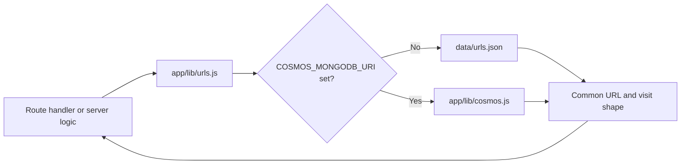
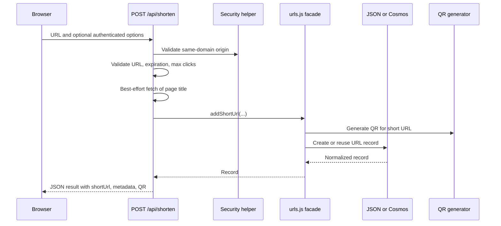
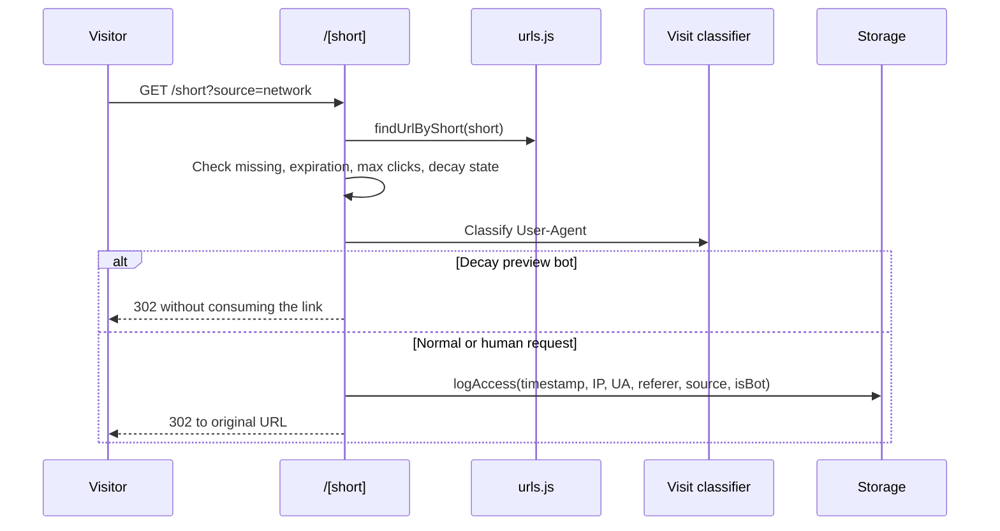

# Technical Design Guide

**Status:** Active implementation guide  
**Audience:** Developers designing and implementing future features  
**Scope:** URL Shortener application in `app/`  
**Last reviewed:** 2026-10-08

## 1. Purpose

This document describes the current technical approach that future features must extend. It is an implementation guide, not a historical record. Historical decisions remain in `ADR.md`; visual rules remain in `Style_And_Design_Rules.md` and `ui-rules.md`.

The application is a Next.js App Router URL shortener with:

- Public URL creation and redirect flows.
- Authenticated management, statistics, and analytics surfaces.
- A storage abstraction supporting local JSON and MongoDB API for Azure Cosmos DB.
- Server-side visit logging, bot classification, social-source attribution, QR generation, and link metadata.
- Client-rendered interactive management and analytics interfaces.

## 2. Design Principles

1. **Extend existing boundaries.** Add behavior to the appropriate route, shared library, adapter, or component rather than duplicating logic in a page.
2. **Preserve backend parity.** Any persistence feature must work through both `app/lib/urls.js` and `app/lib/cosmos.js`, unless the feature is explicitly local-only.
3. **Keep public and protected data separate.** Public statistics intentionally expose only non-private links; management and analytics APIs are protected by middleware.
4. **Classify visits at the request boundary.** Redirects capture User-Agent, referer, source, IP, and visitor type before writing the visit record.
5. **Prefer additive, backward-compatible fields.** Existing records may omit newer fields. Normalize optional values when reading them.
6. **Keep presentation dependency-free.** Current analytics use custom SVG/CSS and current QR generation uses `qrcode` and `jimp`; introduce a new dependency only with a recorded decision.
7. **Make states explicit.** New UI features must define loading, success, error, empty, disabled, and responsive states.
8. **Use semantic and accessible UI.** Preserve heading hierarchy, labels, keyboard operation, focus states, accessible names, and safe link behavior.

## 3. System Architecture

```mermaid
flowchart TD
    Browser[Browser]
    Header[Root layout and navigation]
    Home[Public homepage]
    List[Protected URL list]
    Stats[Protected link stats]
    APIs[Next.js route handlers]
    Redirect[Dynamic /[short] redirect]
    Domain[Shared domain/storage facade: app/lib/urls.js]
    Analytics[Analytics aggregation: app/lib/analytics.js]
    VisitClass[Visit classification: app/lib/visit-classification.js]
    QR[QR generation: app/lib/qr.js]
    File[(data/urls.json)]
    Cosmos[(MongoDB API / Azure Cosmos DB)]

    Browser --> Header
    Header --> Home
    Header --> List
    Header --> Stats
    Home --> APIs
    List --> APIs
    Stats --> APIs
    Browser --> Redirect
    APIs --> Domain
    Redirect --> Domain
    Redirect --> VisitClass
    Domain --> File
    Domain --> Cosmos
    Domain --> QR
    APIs --> Analytics
    Analytics --> Domain
    Analytics --> VisitClass
```

### Runtime layers

| Layer | Responsibility | Primary files |
| --- | --- | --- |
| App shell | Metadata, sticky header, auth-aware navigation, footer | `app/layout.js`, `app/globals.css` |
| Pages/components | User interaction, local state, rendering, client fetches | `app/page.js`, `app/list/page.js`, `app/stats/[short]/page.js`, `app/components/*` |
| Route handlers | HTTP validation, origin checks, response shaping, auth boundary integration | `app/api/**/route.js`, `app/[short]/route.js` |
| Domain/storage facade | Backend selection and shared URL operations | `app/lib/urls.js` |
| Storage adapters | JSON or MongoDB persistence and record normalization | `app/lib/urls.js`, `app/lib/cosmos.js` |
| Cross-cutting libraries | Security, analytics, classification, QR, title handling | `app/lib/security.js`, `analytics.js`, `visit-classification.js`, `qr.js`, `page-title.js` |
| Request middleware | Protects list, stats, URL, visit, and analytics routes | `middleware.js` |

## 4. Runtime and Persistence Strategy

`app/lib/urls.js` is the application-facing storage interface. It selects the backend using the server-side presence of `COSMOS_MONGODB_URI`:

- **Absent or empty:** local JSON implementation using `data/urls.json`.
- **Configured:** MongoDB driver implementation in `app/lib/cosmos.js`, targeting Azure Cosmos DB's MongoDB API.

The selection is not based on `NODE_ENV`. Developers must inspect environment variables when local data appears missing.



### Storage adapter contract

When adding a persisted feature, preserve equivalent behavior in both adapters. Existing operations include:

- `readUrls()` and `findUrlByShort(short)`
- `addShortUrl(originalUrl, isPrivate, title, customSlug, expiresAt, maxClicks, isDecay)`
- `logAccess(short, accessInfo)`
- `updateUrlVisibility(short, isPrivate)`
- `getRecentVisits(limit)`
- `regenerateQrCode(short)`
- `updateUrlTitle(short, title)`
- `isUrlExpired(entry)`

Return shapes should remain compatible with existing pages and APIs. Optional fields should use stable defaults such as `null`, `false`, `''`, or `[]` rather than being omitted unpredictably.

### Current URL record shape

```js
{
  id: 'sixCharOrCustomSlug',
  original: 'https://example.com/resource',
  created: '2026-10-08T12:00:00.000Z',
  stats: [
    {
      timestamp: '2026-10-08T12:01:00.000Z',
      ip: 'unknown',
      userAgent: 'Mozilla/5.0 ...',
      referer: '',
      source: '',
      is_bot: false
    }
  ],
  qrCode: 'data:image/png;base64,...',
  private: false,
  title: null,
  expiresAt: null,
  maxClicks: null,
  decay: false
}
```

The Cosmos adapter stores URL metadata and visit records separately, then joins visits into the URL shape returned by the facade. Do not assume that `stats` is physically embedded in Cosmos.

## 5. Main Request Flows

### Standard shortening



Creation options are intentionally mode-specific:

- Standard links may use private visibility, custom alias, expiration, and max clicks.
- Decay links are forced private and do not use standard expiration/custom-alias behavior.
- Anonymous homepage clients send only the basic URL for login-gated options.

### Redirect and visit logging



Redirect logging must remain best-effort: a storage logging failure should not prevent the redirect response. Never trust `source`, User-Agent, IP, or referer as authentication data; they are analytics metadata.

## 6. API and Route Conventions

### Public routes

| Route | Method | Purpose |
| --- | --- | --- |
| `/api/shorten` | `POST` | Validate and create/reuse a standard or Decay link |
| `/api/public-stats` | `GET` | Return public-only counts and up to five recent public links |
| `/api/auth/status` | `GET` | Tell the homepage whether the auth cookie is present |
| `/[short]` | `GET` | Resolve a short code, log the visit, and issue a 302 or 410 |
| `/api/auth/login` | `POST` | Validate configured admin credentials and set the auth cookie |
| `/api/auth/logout` | `GET` | Clear the auth cookie and redirect to login |

### Protected routes

Middleware currently protects `/list`, `/stats/**`, `/api/urls/**`, `/api/stats/**`, `/api/visits`, and `/api/analytics` when the `auth=true` cookie is absent. Route handlers should still validate inputs and same-domain origin using `app/lib/security.js`.

| Route | Method | Purpose |
| --- | --- | --- |
| `/api/urls` | `GET` | List URL records with enriched short URLs and normalized visit flags |
| `/api/urls/[id]` | `PATCH` | Change public/private visibility |
| `/api/stats/[short]` | `GET` | Return link details, access logs, and human/bot counts |
| `/api/stats/[short]` | `POST` | Regenerate the persisted QR code |
| `/api/stats/[short]/title` | `POST` | Refresh the original page title when implemented by the route |
| `/api/visits` | `GET` | Return the latest 50 visits |
| `/api/analytics` | `GET` | Return range-filtered all-link or single-link analytics |

For new endpoints:

1. Validate request method payload and route parameters.
2. Apply `isAllowedOrigin()` for mutation and data APIs.
3. Use the shared facade instead of importing a storage adapter directly.
4. Return stable JSON error messages and appropriate HTTP statuses.
5. Add the route to `middleware.js` if it exposes protected information.
6. Keep public responses free of private URL metadata.

## 7. Analytics and Visit Classification

`app/lib/visit-classification.js` is the shared classification layer. `classifyVisit()` preserves the intended explicit `is_bot`/`isBot` compatibility semantics and falls back to User-Agent rules for legacy records; `normalizeVisitStat()` supplies stable fields.

`app/lib/analytics.js` aggregates only after the selected range is applied. Current range values are `week`, `month`, `quarter`, and `all`. It returns:

- Human/bot totals and period series.
- Browser rankings from human visits only.
- Referrer/source rankings.
- Stable bot/product-name rankings.
- Human and bot social-source rankings for LinkedIn, Mastodon, X, Notes, Substack, and `unknown`.
- A Monday-based period series for quarter/all-time ranges.
- A seven-day by 24-hour heatmap.

When adding an analytic measure, calculate it in `buildAnalytics()`, expose it additively from `/api/analytics`, and render it in `AnalyticsDashboard.js` with a title, explanatory metadata, numeric values, empty state, and responsive styling. Do not infer visitor type independently in a page component.

## 8. Frontend Composition Patterns

### Homepage

`app/page.js` is a client component with independent Standard and Decay form state. Results and errors are scoped to their originating form. Follow this pattern when adding another independent action: isolate input, loading, error, result, and disabled state.

The homepage currently includes:

- Editorial left panel and primary Standard form.
- Collapsible login-gated advanced options.
- Full-width Decay form with warning copy.
- Public stats and recent public links.
- QR previews and copy/open actions.

### Management list

`app/list/page.js` owns client-side search, sorting, column selection, pagination, localStorage caching, visibility mutation, social sharing popup, recent visits, and all-links analytics. Reuse `PageNavigator` and keep expensive data operations server-backed where practical.

### Stats detail

`app/stats/[short]/page.js` renders link details beside QR actions, then link analytics, then a paginated sortable access log. Add link-specific metrics through `/api/analytics?short=...` rather than duplicating aggregation.

### Shared components

- `AnalyticsDashboard.js`: range selector and custom SVG/CSS visualizations.
- `PageNavigator.js`: first/previous/next/last navigation.
- `RecentVisitsPager.js`: ten-row pages over the server-limited latest-50 response.

## 9. Security and Privacy Rules

- Keep database connection strings server-only. Use `COSMOS_MONGODB_URI`, never a `NEXT_PUBLIC_` equivalent.
- Preserve the `httpOnly`, `sameSite=lax` auth cookie behavior and middleware boundary unless a new authentication design is recorded.
- Do not expose private or Decay records through `/api/public-stats`.
- Keep Decay links private, preview-bot protected, single-use for human visitors, and retained only for internal statistics as specified by current behavior.
- Validate URL input server-side. Client validation improves UX but is not a security boundary.
- Do not use User-Agent classification as identity, authorization, or fraud proof.
- Escape or safely render any new user-controlled content. Avoid building raw HTML unless it is required and carefully constrained.
- Preserve same-origin checks for API calls and use `rel="noopener noreferrer"` for new-tab external links.

## 10. Feature Development Workflow

1. **Define the user task and boundary.** Decide whether the feature is public, authenticated, admin-only, standard-link-only, Decay-only, or cross-cutting.
2. **Locate the owning layer.** Page interaction belongs in a client page/component; HTTP behavior belongs in a route handler; persistence belongs behind `urls.js`; shared calculations belong in a library.
3. **Check current contracts.** Read the relevant page, route, facade, both storage adapters, middleware, and existing style/design rules.
4. **Design the data shape.** Prefer optional additive fields, defaults, backward-compatible normalization, and file/Cosmos parity.
5. **Implement server behavior first.** Validate input, preserve origin/auth checks, update adapters, and shape a stable response.
6. **Implement the UI states.** Add semantic headings, labels, loading/error/empty/success states, keyboard behavior, and responsive layout.
7. **Reuse visual and interaction patterns.** Use existing tokens, buttons, tables, cards, QR treatment, analytics styles, and `PageNavigator`.
8. **Review privacy and failure modes.** Test anonymous access, authenticated access, private records, legacy records, missing data, storage failure, long URLs, and bot/preview requests.
9. **Document the change.** Update this guide only when a durable pattern changes; add a numbered ADR for architectural decisions and update project memory.

## 11. Quality Checklist

- [ ] Public/protected boundary is explicit and enforced by middleware where required.
- [ ] Same-domain validation is applied to relevant APIs.
- [ ] Both JSON and Cosmos paths behave equivalently.
- [ ] Existing records without the new field still render correctly.
- [ ] URL creation, redirect, logging, and analytics flows remain intact.
- [ ] Standard and Decay semantics are not accidentally mixed.
- [ ] Loading, error, empty, disabled, and success states exist.
- [ ] Form controls have visible labels and keyboard-accessible actions.
- [ ] Long URLs, titles, User-Agents, and referers wrap safely.
- [ ] Mobile layouts do not introduce page-level horizontal overflow.
- [ ] Analytics includes an explanation and numeric/text equivalent for each visual.
- [ ] QR codes encode the shortened URL and have useful alternative text.
- [ ] No credentials or private records are exposed to the client.
- [ ] The relevant ADR, reasoning notes, and project memory are updated.

## 12. Known Source Alignment Notes

This guide reflects the inspected source files as of 2026-10-08. Some historical project-memory entries describe planned or previously implemented role/account APIs, but the currently inspected `app/lib/auth.js`, `app/api/my-history/route.js`, `app/api/my-urls/route.js`, `app/api/admin/users/route.js`, and `app/account/page.js` are empty. Future work must treat the live source as authoritative and should not assume role-based authentication or ownership features are available until implemented and documented.

Similarly, `middleware.js` currently uses a boolean `auth=true` cookie, while older architectural notes mention signed sessions. Any security upgrade should be designed as a dedicated authentication decision rather than silently assuming that behavior already exists.

## 13. Related Documentation

- `README.md` — business overview, setup, and high-level architecture.
- `ADR.md` — numbered architectural history and exceptions.
- `Style_And_Design_Rules.md` — active visual and accessibility implementation rules.
- `Technical_Bot_Selection.txt` — database switch, bot classification, and deployment guidance.
- `ui-rules.md` — broader editorial design reference.
